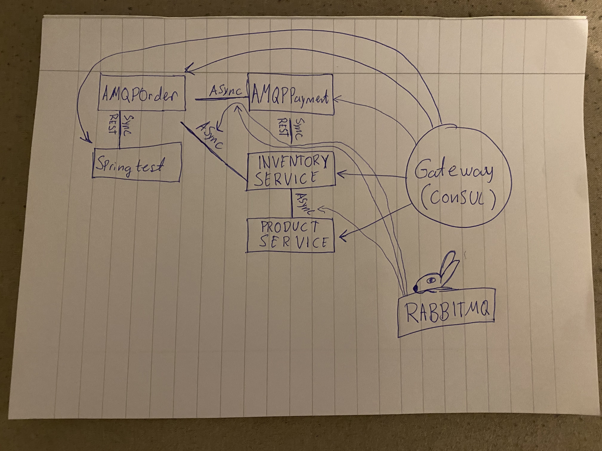
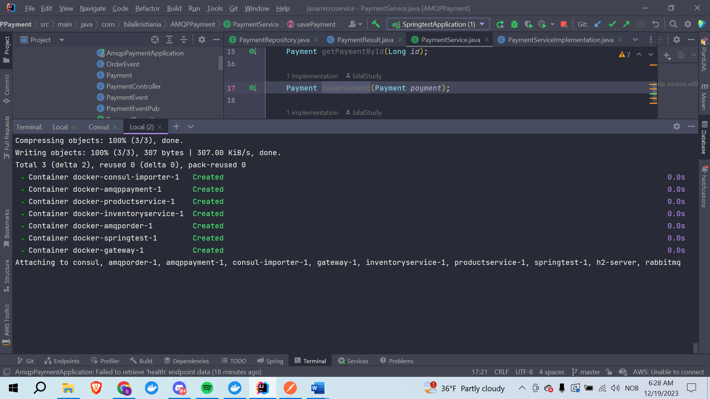

# Microservices Application Setup Guide
## this repository is also based on this repositiory
https://github.com/bilalStudy/amqpconfig
and has its own link at
https://github.com/bilalStudy/javamicroservice

## Overview
This guide outlines the setup process for a microservices-based application involving various services like User, Product, Order, Payment, and Inventory, along with a Gateway service. The application utilizes RabbitMQ, Consul, and H2 database, and is managed through Maven and Docker.

## Prerequisites
- RabbitMQ
- Consul
- H2 Database
- Maven
- Docker

## Service Ports
- User Service (springtest): `8080`
- Product Service (Car product): `8081`
- Order Service (AMQPOrder): `8082`
- Payment Service (AMQPayment): `8083`
- Inventory Service: `8084`
- Gateway Service: `9080`
- Frontend: `1234`

## Local Setup
1. **RabbitMQ & Consul**: Start RabbitMQ and Consul. Consul can be started with `consul agent -node=learnmicro -dev`. On Windows, use `.\consul agent -node=learnmicro -dev`.
2. **Maven**: Navigate to the microservice directory (e.g., `AMQPOrder/AMQPOrder`) and run `mvn clean install` to generate the `target` folder with a `.jar` file.
3. **Microservice Startup**: Start all microservices. Note that services like AMQPOrder, AMQPPayment, Inventory, and Product Service might crash initially due to non-existent queues. Restart them after the initial run. Notices this 2 days before when testing on another computer.
4. **Dealing with H2**: Sometimes H2 will crash if you have corrupted the files, its not something that should happen but deleting the local files and restarting the service should usually solve this. i doubt this is needed but its okey to know about.

## Data Initialization
Use Postman or curl commands to initialize data:
- **User**: POST `http://localhost:8080/api/users`
  ```json
  {
    "name": "Jon Jones",
    "address": "Hollywood Street",
    "age": 36
  }
  ```
- **Product Service**: POST `http://localhost:8081/api/products`
  ```json
  {
    "carName": "Car Model X",
    "manufacturer": "JavaGuar",
    "color": "black",
    "fuel": "electric",
    "transmission": "automatic",
    "price": 5000000.00,
    "description": "JavaGuars newest edition, SUV 4 wheel drive",
    "available": true
  }
  ```
- **Inventory**: POST `http://localhost:8084/api/inventory`
  ```json
  {
    "productId": 1,
    "quantity": 200
  }
  ```
- **Order**: POST `http://localhost:8082/api/orders/save`
```json

{
  "userId": 1,
  "productId": 1,
  "productName": "Car Model X",
  "orderDate": "2023-12-15",
  "status": "Pending",
  "productAmount": 20000.0,
  "orderItems": [
    {
      "equipmentId": 101,
      "equipmentName": "Tires",
      "quantity": 4,
      "unitPrice": 100.0,
      "subtotal": 0.0
    },
    {
      "equipmentId": 102,
      "equipmentName": "Sunroof",
      "quantity": 1,
      "unitPrice": 500.0,
      "subtotal": 0.0
    }
  ]
}
```

## Payment Info
And we could also create a POST to payment at http://localhost:8083/api/payment but this takes only one account for the transaction and that is the account with id 1, if you don't create it before the service exists but have done all the other posts it will automatically create the account with a balance of 4000000

## Frontend
To run the frontend, you need Node.js and npm installed. You can run the frontend with the following command:

```bash
cd client
npm run start
```

## Additional info
I would recommend creating all these various posts to save before trying to send an order.
I would also recommend creating multiple products, inventory with the productsId that you created and maybe create more users to play around with the frontend a bit.

## Dockerization
To dockerize the application:you cd into the respective microservice and do docker build -t microservice name that corresponds with the docker-compose.yml and then add a punctuation so it builds from the dockerfile in the directory you are in. as an example in my docker-compose the AMQPOrder service is named amqporder:latest so then I need that image

1. Navigate to the microservice directory.
2. Run `docker build -t [microservice name]:latest .`.
3. In `docker/h2` and `docker/consul`, run `docker build -t h2-server:2.1.214 .` and `docker build -t consul-importer:1.9 .`, i also did `docker build -t consul .` but i dont know if that is needed respectively.

## Running Docker Compose
- Use `docker compose -f docker-compose.yml up --build` in the `docker/` folder.
- Alternatively, to run without microservices use `docker compose -f docker-compose-no-microservices.yml up --build`.

## Additional Notes

I hope there is some lenience on the docker part since I used a total of 6 hours to make it run on my machine. Despite it saying that it wasn't possible to run wsl(windows subsystem for linux) on windows 10 home. And my pc not having support for hyper-v virtualization. Despite this it should still be running.
## Diagram

## Application Workflow
For how the microservice application works. When everything of the data is set at the company for luxury cars, it will initiate both synchronous calls and asynchronous calls when an order from the client is sent. This order will then check if the userId exists with a synchronous REST api call and also send the OrderEvent if the user exists to the InventoryService and PaymentService with asynchronous event driven communication using RabbitMQ. In the inventory we will see if there is stock for the productId given by the order, and then return true if we do have stock aswell as remove one from the quantity for that product. This inventory service also sends an event to the product service and updates the availability of the product to false if we are out of stock. The orderevent is also sent from the order to the payment, the payment does a rest call to the inventory service with the productId given and checks for stock with a REST call, if we do indeed have stock we will process the payment and send it back to order. In order after payment, the order is saved as completed. The call from payment to inventory to check for stock should in theory not happen but I will talk more about this in the reflection documentation. The gateway is load balancing, health checking and has centrally configuration.


## Microservices Overview

## AMQPOrder Service
- Manages order-related operations.
- Communicates with the Inventory Service to check stock availability and with the AMQPPayment Service to process payments.
- Performs REST calls to the Springtest (User Service) to validate the legitimacy of the userId associated with each order.

## AMQPPayment Service
- Processes payment events related to orders.
- Assesses if users have sufficient funds and communicates the outcome back to the AMQPOrder Service.
- Makes REST calls to the Inventory Service to confirm stock availability before processing orders.

## Gateway Service
- Acts as the primary entry point to the microservices ecosystem.
- Routes requests to the appropriate microservices, managing load balancing and service discovery.
- Implements global configurations such as CORS settings and common filters like retry logic.

## Inventory Service
- Responds to order events by checking stock levels.
- Adjusts stock quantities based on order details and informs the AMQPOrder Service about stock availability.
- Sends events to the ProductService to update real-time product availability.

## Product Service
- Represents the actual products, mainly cars, in the system.
- Receives updates from the Inventory Service to reflect real-time availability of products.

## Springtest (User Service)
- Provides functionalities for creating and managing mock users.
- Ensures that user IDs provided in orders correspond to actual, legitimate users in the system.

## User Stories
The user stories from the arbeidskrav: As a potential car buyer. I want to view a list of available cars. So that I can select a car to purchase.
As a registered user/mock user. I want to be able to place an order for a selected car. So that I can initiate the car purchase process.Æ
As a user placing an order/mock user. I want to be notified if my order is successfully processed or canceled. So that I am aware of the status of my car purchase.
As a user making a purchase/mock user. I want to have a receipt for my completed purchases.
So that I can keep a record of my transactions. All of these are implemented,
but the details for them could be nicer in the frontend. also some more details on this in the reflection document.

## Pictures of Working Application
